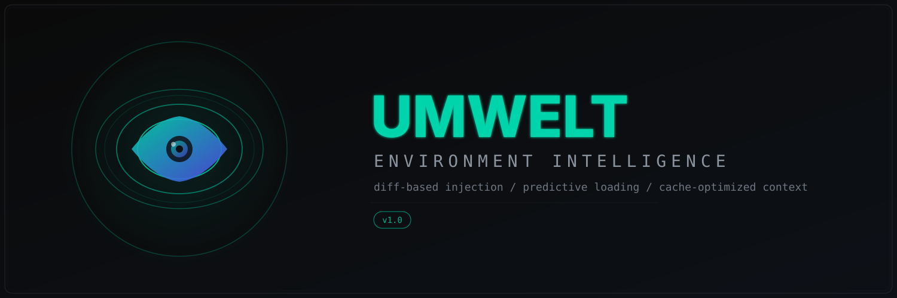
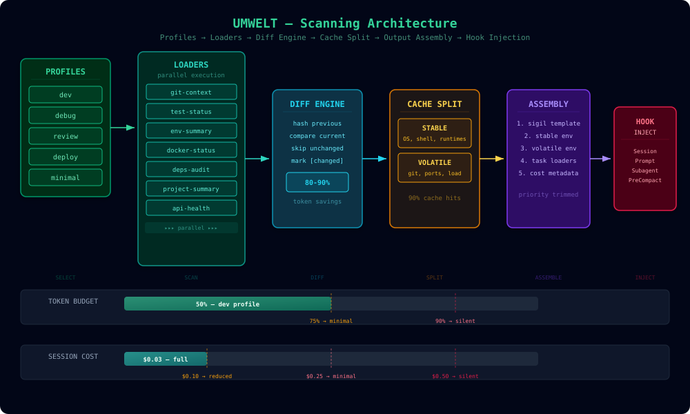
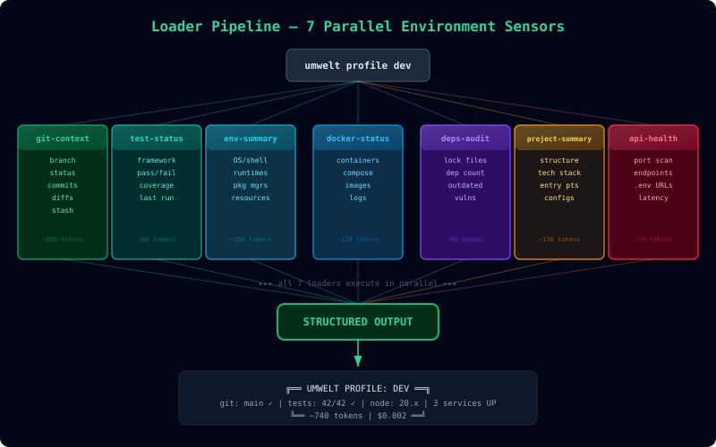
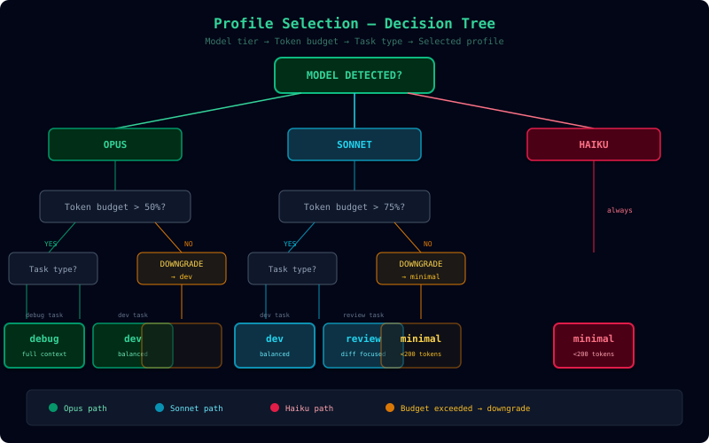
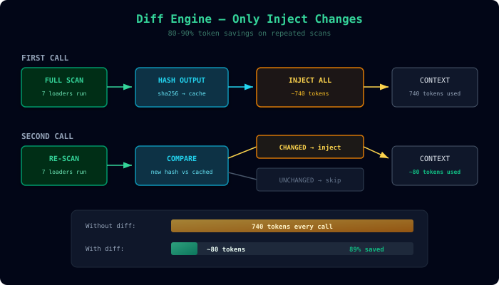

<p align="center"><strong>Environment intelligence for AI-assisted development.</strong></p>
<p align="center">Scans your development environment — git, tests, Docker, APIs, dependencies — and injects structured context into AI sessions. Your AI sees what you see.</p>

<p align="center">
  
  
  
  
  
  
</p>

---

## Why "Umwelt"

In 1909, the biologist **Jakob von Uexküll** introduced the concept of *Umwelt* — the idea that every organism inhabits its own perceptual world, constructed from the signals its sensory apparatus can detect. A tick perceives only butyric acid, warmth, and hair density. A bat perceives only ultrasonic echoes. Each organism's Umwelt is a *self-centered bubble of perception* — not the objective environment, but the environment as experienced.

An AI coding assistant has the same problem. It sits inside a context window with no eyes, no ears, no sensors. It cannot see your git branch, your failing tests, your Docker containers, or your dependency vulnerabilities. Without sensory input, it operates blind.

**Umwelt constructs the AI's perceptual world.** It scans your development environment through 7 specialized sensors (loaders), assembles a structured picture of your project's state, and injects that perception into the AI's context before it processes your prompt. The AI stops guessing. It *perceives*.

Every scan is an Umwelt — a self-centered world built for this AI, this project, this moment.

---

Built on reverse-engineered knowledge of Claude Code's internal architecture. Ten innovations derived from analysis of 561K+ lines of extracted source code.

Your environment, perceived with precision.

## Architecture

<p align="center">
  
</p>

## Features

| | Feature | What It Does |
|---|---------|-------------|
| **1** | **Diff-Based Injection** | Caches previous scans and only injects changes — 80-90% token savings on repeated calls |
| **2** | **Token-Aware Profiling** | Tracks cumulative injection per session, auto-downgrades profiles as context fills |
| **3** | **Cache-Friendly Output** | Splits output into STABLE (cached) and VOLATILE (fresh) sections — enables 90% cost savings via prompt caching |
| **4** | **Event-Optimized Loading** | Full environment scan on SessionStart, lightweight diffs on every prompt thereafter |
| **5** | **Model-Aware Profiles** | Detects Opus/Sonnet/Haiku and auto-selects appropriate context depth |
| **6** | **Cost-Conscious Scanning** | Tracks session injection cost, auto-reduces scanning when budget thresholds are hit |
| **7** | **Intelligent Loaders** | Loaders skip themselves when irrelevant — no Docker output if Docker isn't running |
| **8** | **Predictive Context Loading** | Analyzes user message keywords to predict which loaders matter before scanning |
| **9** | **Smart PreCompact** | Preserves critical environment state before Claude Code's context compaction |
| **10** | **Unified Context Engine** | Combines Umwelt environment data with [Sigil](https://github.com/pkmdev-sec/sigil) prompt templates into a single optimized injection |

## Quick Start

```bash
# Install
git clone https://github.com/pkmdev-sec/umwelt.git ~/.claude/umwelt
~/.claude/umwelt/umwelt install

# Scan your environment
umwelt profile dev

# Use with Claude Code
# !`umwelt profile dev` Fix the failing tests
```

## Installation

### Option 1: Clone (recommended)

```bash
git clone https://github.com/pkmdev-sec/umwelt.git ~/.claude/umwelt
~/.claude/umwelt/umwelt install    # Symlinks to ~/.local/bin/umwelt
```

### Option 2: Manual

```bash
# Download and place anywhere
# Add the directory to your PATH, or symlink the executable:
ln -sf /path/to/umwelt/umwelt ~/.local/bin/umwelt
```

### Verify

```bash
umwelt --version    # 2.1.0
umwelt list         # Show available loaders and profiles
umwelt test         # Run self-tests (100+ assertions)
```

## Usage

### Bang Syntax (direct injection)

```
# In Claude Code CLI:
!`umwelt profile dev` What should I work on next?
!`umwelt git-context --diff` Review my staged changes
!`umwelt profile deploy` Is this ready to ship?
!`umwelt compose git-context test-status` Fix the failing tests
```

### Custom Slash Commands

Installed automatically:

| Command | What It Does |
|---------|-------------|
| `/ctx [question]` | Load dev context, then answer your question |
| `/deploy-check` | Run deployment readiness check |
| `/sitrep` | Full situation report |
| `/debug-ctx [issue]` | Load debug context, troubleshoot an issue |

### Hook-Based Auto-Injection

```bash
# Auto-inject on every prompt
umwelt install-hook UserPromptSubmit git-context

# Load project summary once per session
umwelt install-hook SessionStart project-summary

# Preserve context before compaction
umwelt install-hook PreCompact git-context

# Remove a hook
umwelt uninstall-hook UserPromptSubmit git-context
```

## Loaders

Seven specialized environment sensors, each extracting one dimension of context.

<p align="center">
  
</p>

### git-context
```bash
umwelt git-context                 # Branch, status, recent commits
umwelt git-context --minimal       # Branch and status only
umwelt git-context --full          # + staged and unstaged diffs
```

### test-status
```bash
umwelt test-status                 # Framework detection + last results
umwelt test-status --run           # Actually run tests and report
umwelt test-status --coverage      # Show coverage summary
```
Detects: vitest, jest, mocha, pytest, cargo test, go test, swift test, npm test

### env-summary
```bash
umwelt env-summary                 # OS, shell, runtimes, project type
umwelt env-summary --full          # + disk, memory, load, Claude env vars
```

### docker-status
```bash
umwelt docker-status               # Running containers, compose services
umwelt docker-status --full        # + disk usage, recent logs
```

### deps-audit
```bash
umwelt deps-audit                  # Lock freshness, dep counts
umwelt deps-audit --full           # + npm audit, outdated check
```
Detects: npm/pnpm/yarn/bun, pip/poetry, cargo, go modules

### project-summary
```bash
umwelt project-summary             # File counts, structure, entry points
umwelt project-summary --full      # + npm scripts, README excerpt
```

### api-health
```bash
umwelt api-health                  # Scan common local ports
umwelt api-health --full           # + .env API URLs
UMWELT_API_ENDPOINTS="https://api.example.com/health" umwelt api-health
```

## Profiles

Task-specific loader combinations. Each profile runs its loaders in parallel.

<p align="center">
  
</p>

### dev — Development
```bash
umwelt profile dev                 # git + tests (last) + env (minimal) + project
umwelt profile dev --full          # Everything at full detail
```

### review — Code Review
```bash
umwelt profile review              # Diff against main + commits + tests
umwelt profile review develop      # Diff against develop branch
```

### deploy — Deployment Check
```bash
umwelt profile deploy              # Full pre-deploy checklist with READY/NOT READY verdict
```

### debug — Debugging
```bash
umwelt profile debug               # Full env + docker logs + error scanning + processes
```

### minimal — Ultra-Light
```bash
umwelt profile minimal             # cwd + branch only (<200 tokens)
```

## Compose

Mix and match loaders ad-hoc:

```bash
umwelt compose git-context test-status              # Git + tests
umwelt compose env-summary docker-status api-health  # Infrastructure overview
umwelt compose git-context deps-audit project-summary # Full project state
```

## Diff Engine

<p align="center">
  
</p>

Caches previous scans and only injects changes. Dramatically reduces token waste on repeated calls.

```bash
umwelt --diff compose git-context test-status    # Skips unchanged loaders
umwelt --diff git-context                        # Skips if git state unchanged
```

**How it works:** Previous scan output is hashed. On next call, new output is compared. If identical, the loader is skipped entirely. If changed, only the changed loader's output is injected with a `[changed]` marker.

## Token-Aware Profiling

Tracks cumulative token injection per session and auto-downgrades:

| Budget Used | Action |
|------------|--------|
| < 50% | No change |
| 50% | debug → dev |
| 75% | any → minimal |
| 90% | any → silent (no output) |

```bash
umwelt --budget 5000 profile dev    # Auto-downgrades when nearing 5000 tokens
```

## Cost-Conscious Scanning

Tracks injection cost per session using Sonnet pricing ($3/M input tokens):

| Session Cost | Mode | Behavior |
|-------------|------|----------|
| < $0.10 | `full` | All loaders, no restrictions |
| $0.10–$0.25 | `reduced` | Skip docker, api-health, deps-audit |
| $0.25–$0.50 | `minimal` | Git + project only |
| > $0.50 | `silent` | No injection, log only |

```bash
umwelt cost status    # [Umwelt cost: $0.03 | Budget: 6% | Mode: full]
umwelt cost reset     # Reset session cost
```

## Model-Aware Profiles

Detects Claude model tier and selects appropriate context depth:

| Model Tier | Default Profile | Rationale |
|-----------|----------------|-----------|
| Opus | debug | Full context worth it, large context window |
| Sonnet | dev | Balanced context/cost |
| Haiku | minimal | Token-constrained |

```bash
umwelt --model haiku profile dev    # Forces minimal profile
umwelt --model opus profile dev     # Uses full debug profile
CLAUDE_MODEL=opus umwelt profile dev # Auto-detection via env var
```

## Intelligent Loaders

Loaders are context-aware — they skip themselves when their output would be useless:

- `docker-status`: skipped if Docker not installed or not running
- `api-health`: skipped if no services on common ports
- `test-status`: skipped if no test framework detected
- `deps-audit`: skipped if no package.json/requirements.txt/etc.

```bash
# Predict relevant loaders from a message
umwelt predict "fix the failing tests"
# → git-context project-summary test-status

umwelt predict "check docker containers"
# → git-context project-summary docker-status
```

## Unified Context Engine (Umwelt + Sigil)

The crown jewel — combines Umwelt environment context with [Sigil](https://github.com/pkmdev-sec/sigil) prompt templates into a single optimized injection.

**Assembly order** (matches Claude's internal prompt section order):
1. Sigil template behavioral instructions (if active)
2. Umwelt stable environment (cached, rarely changes)
3. Umwelt volatile environment (only diffs)
4. Task-relevant loaders (predicted from user message)
5. Cost tracking metadata

**Priority trimming** (when over token budget, lowest priority removed first):

| Priority | Section |
|----------|---------|
| 100 | Sigil template (never trimmed) |
| 90 | Git context |
| 85 | Project summary |
| 60 | Test status |
| 50 | Environment |
| 30 | Docker status |
| 25 | API health |
| 20 | Dependencies |

```bash
umwelt unified                                    # Full unified assembly
umwelt unified UserPromptSubmit "fix the tests"   # Event-aware + message-aware
```

## Configuration

### Environment Variables

| Variable | Default | Description |
|----------|---------|-------------|
| `UMWELT_DIR` | `~/.claude/umwelt` | Framework directory |
| `UMWELT_PROJECT_DIR` | `.` | Project directory for loaders |
| `UMWELT_API_ENDPOINTS` | — | Comma-separated API URLs for health checks |
| `CLAUDE_MODEL` | — | Model tier for auto-profile selection |

### Custom Loaders

Loaders are bash scripts that output structured context. They are the building blocks of Umwelt's intelligence system.

**Loader API contract:**
- Must be executable bash scripts (.sh extension)
- Fast execution (< 2 seconds recommended)
- Output structured text (use headers like `=== SECTION ===`)
- Clean exit with `exit 0`
- Support for `--json` flag (optional)

**Minimal example:**

```bash
#!/usr/bin/env bash
# umwelt: my-custom-loader
set -euo pipefail
MODE="${1:-default}"
echo "=== MY CUSTOM CONTEXT ==="
# ... your context extraction logic ...
echo "=== END MY CUSTOM CONTEXT ==="
```

**Full example with best practices:**

See [examples/custom-loader.sh](examples/custom-loader.sh) for a complete example that demonstrates:
- TODO counting across codebase
- Code coverage reporting
- Security vulnerability detection
- Team conventions detection

**Installation:**
1. Save to `~/.claude/umwelt/loaders/my-custom-loader.sh`
2. Make executable: `chmod +x ~/.claude/umwelt/loaders/my-custom-loader.sh`
3. Use directly: `umwelt my-custom-loader`
4. Or compose: `umwelt compose git-context my-custom-loader`

### Custom Profiles

Profiles orchestrate which loaders run and in what order. They enable task-specific context configurations.

**Minimal example:**

```bash
#!/usr/bin/env bash
# umwelt profile: my-workflow
set -euo pipefail
UMWELT_DIR="${UMWELT_DIR:-$HOME/.claude/umwelt}"
"$UMWELT_DIR/loaders/git-context.sh" "--minimal"
"$UMWELT_DIR/loaders/my-custom-loader.sh"
```

**Advanced example with parallel execution:**

See [examples/custom-profile.sh](examples/custom-profile.sh) for a complete example that demonstrates:
- Sequential vs parallel loader execution
- Custom environment variable configuration
- Profile metadata and descriptions
- Integration with the parallel execution engine

**Installation:**
1. Save to `~/.claude/umwelt/profiles/my-workflow.sh`
2. Make executable: `chmod +x ~/.claude/umwelt/profiles/my-workflow.sh`
3. Use with: `umwelt profile my-workflow`

**Available loaders for composition:**
- `git-context` — Git state, branch, commits, diffs
- `test-status` — Test framework detection and results
- `env-summary` — Shell, runtimes, environment variables
- `docker-status` — Container status, compose services
- `deps-audit` — Dependency health and vulnerabilities
- `project-summary` — Project structure and tech stack
- `api-health` — Local service and API endpoint health

## Examples

The `examples/` directory contains fully-documented example scripts:

### Custom Loader Example

[examples/custom-loader.sh](examples/custom-loader.sh) — A comprehensive example loader that demonstrates:
- Scanning codebase for TODOs
- Reading code coverage reports
- Checking for security vulnerabilities with npm audit
- Detecting team conventions (.editorconfig, .prettierrc, .eslintrc)

**Use it as a starting point:**
```bash
# Copy and customize
cp ~/.claude/umwelt/examples/custom-loader.sh ~/.claude/umwelt/loaders/team-metrics.sh
# Edit to add your team's specific metrics
vim ~/.claude/umwelt/loaders/team-metrics.sh
# Use it
umwelt team-metrics
```

### Custom Profile Example

[examples/custom-profile.sh](examples/custom-profile.sh) — A comprehensive example profile that demonstrates:
- Sequential loader execution (simple approach)
- Parallel loader execution (advanced approach)
- Custom environment variables and configuration
- Profile metadata and documentation

**Use it as a template:**
```bash
# Copy and customize
cp ~/.claude/umwelt/examples/custom-profile.sh ~/.claude/umwelt/profiles/fullstack.sh
# Edit to select your preferred loaders
vim ~/.claude/umwelt/profiles/fullstack.sh
# Use it
umwelt profile fullstack
```

### Loader Customization Guide

**When to create a custom loader:**
- Your team has specific metrics or checks
- You need to integrate with proprietary tools
- You want to expose project-specific context (microservices status, feature flags, etc.)

**Best practices:**
1. **Keep it fast** — Loaders should run in < 2 seconds
2. **Be concise** — Output 10-50 lines max to stay within token budgets
3. **Use caching** — For expensive operations, cache results with TTL
4. **Handle errors gracefully** — Always exit cleanly, even on failures
5. **Follow conventions** — Use `=== SECTION ===` headers for structure

**Loader output format:**
```bash
echo "=== SECTION NAME ==="
echo "key: value"
echo "another-key: another-value"
echo ""
echo "--- Subsection ---"
echo "  item 1"
echo "  item 2"
echo "=== END SECTION NAME ==="
```

**Testing your loader:**
```bash
# Test output
~/.claude/umwelt/loaders/my-loader.sh

# Test with Bang syntax
!`umwelt my-loader` What do you see in the context?

# Test timing
time ~/.claude/umwelt/loaders/my-loader.sh
```

## API Reference

### CLI

```
umwelt <command> [options]

Commands:
  <loader> [flags]              Run a context loader
  profile <name> [flags]        Run a context profile
  compose <l1> <l2> ...         Compose multiple loaders
  predict <message>             Predict relevant loaders
  smart <event> [message]       Event routing + prediction
  unified [event] [message]     Unified context assembly
  cached-context                Cache-split output
  cost status|reset|profile     Cost tracking
  list                          List loaders and profiles
  hook-config [event] [profile] Generate hook JSON
  install                       Install to PATH
  test [target]                 Run self-tests
  --help, -h                    Show help
  --version, -v                 Show version

Flags:
  --diff                        Enable diff-based injection
  --model <opus|sonnet|haiku>   Set model tier
  --budget <N>                  Set token budget
```

### Library Functions

```bash
# Diff engine
source ~/.claude/umwelt/lib/diff-engine.sh
diff_inject "loader-name" "$output"       # Returns 0 if changed
get_diff_summary "loader-name" "$output"  # "[loader: 5 lines changed]"

# Token budget
source ~/.claude/umwelt/lib/token-budget.sh
estimate_tokens "text"        # chars/4 approximation
check_token_budget            # remaining tokens
should_downgrade "debug"      # recommended profile

# Cache split
source ~/.claude/umwelt/lib/cache-split.sh
format_stable_context         # OS, shell, runtimes
format_volatile_context       # git status, load, ports

# Cost tracker
source ~/.claude/umwelt/lib/cost-tracker.sh
estimate_injection_cost "text"
should_inject                 # check budget

# Loader intelligence
source ~/.claude/umwelt/lib/loader-intelligence.sh
is_loader_relevant docker-status
predict_relevant_loaders "fix the tests"
estimate_loader_tokens git-context

# Unified engine
source ~/.claude/umwelt/lib/unified-engine.sh
# Assembles Umwelt + Sigil into unified context
```

## Self-Test

```bash
umwelt test              # Test everything (100+ assertions)
umwelt test loaders      # Test loaders only
umwelt test profiles     # Test profiles only
umwelt test cli          # Test CLI commands only
```

## Project Structure

```
~/.claude/umwelt/
├── umwelt                       # Main CLI (v2.1)
├── umwelt-adaptive.sh           # Model-aware adaptive router
├── umwelt-cache-warm.sh         # SessionStart cache warming
├── umwelt-precompact.sh         # PreCompact context preservation
├── lib/
│   ├── config.sh                # Configuration system
│   ├── output.sh                # Text/JSON formatting
│   ├── parallel.sh              # Parallel execution engine
│   ├── diff-engine.sh           # Diff-based injection
│   ├── token-budget.sh          # Token-aware profiling
│   ├── cache-split.sh           # Cache-friendly output
│   ├── cost-tracker.sh          # Cost-conscious scanning
│   ├── loader-intelligence.sh   # Intelligent loaders
│   ├── predictor.sh             # Predictive context loading
│   ├── event-router.sh          # Event-optimized loading
│   └── unified-engine.sh        # Umwelt+Sigil fusion
├── loaders/                     # 7 environment sensors
│   ├── git-context.sh
│   ├── test-status.sh
│   ├── env-summary.sh
│   ├── docker-status.sh
│   ├── deps-audit.sh
│   ├── project-summary.sh
│   └── api-health.sh
├── profiles/                    # Task-specific packages
│   ├── dev.sh
│   ├── debug.sh
│   ├── review.sh
│   ├── deploy.sh
│   └── minimal.sh
├── templates/                   # Example prompts
├── tests/                       # 100+ test assertions
└── docs/                        # Documentation
```

## Contributing

See [CONTRIBUTING.md](CONTRIBUTING.md) for guidelines.

1. Fork the repository
2. Create a feature branch: `git checkout -b feature/my-loader`
3. Write tests for your changes
4. Run `umwelt test` to verify
5. Submit a pull request

## License

[MIT](LICENSE) — use freely, attribute kindly.

---

<p align="center">
  <strong>Umwelt</strong> — the AI's perceptual world, constructed from your environment.<br/>
  <em>Pair with <a href="https://github.com/pkmdev-sec/sigil">Sigil</a> for the complete Claude Code intelligence stack.</em>
</p>
